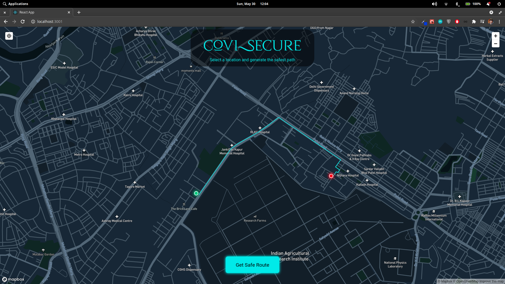
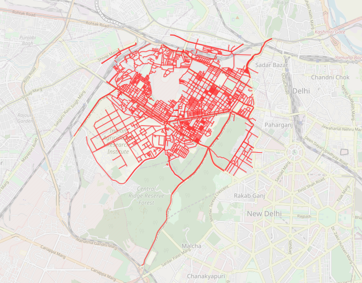

# go-Corona-go

The project aims to aid safe travelling for people by providing the safest path from a source to a destination.

Currently the implementation only consists of the locality in Delhi, but it can further implemented such that it takes the locality of the user as a parameter.



### DEMO VIDEO
https://youtu.be/lcXM4QS5a_Y

### graph-parser-osm
Consists of Java program that parses OSM (OpenStreetMap) XML files into json graph representation.

* It was used to detect all the roads present in the given area (in the form of map.osm).
* Input given is the .osm file and output is the json file consisting of nodes which are intersection of roads with latitudes, longitudes, unique index and weights.
* This can be treated as a black-box or a tool to get the nodes of the graph in the locality.

## Instructions
* Follow the steps:
1. Both in parent as well as in covi-secure directory
```shell
npm install 
```
2. Open two terminal windows:
- In one window stay in the parent directory & run:
```
nodemon
```
In other window, open covi-secure directory & run:
```
npm start
```

## Implementation
* `index.js` is the master file.
* Given the starting & ending latitude and longitude we find the nearest node to these locations.
* The project currently consists of fake crowd data / simulation. It can easily be used on real data. 
* `infected.json` consists of the latitude and longitude of the infected people which has been generated by `fake_data.py`. 
* The real world data can also be collected and refreshed in time intervals to give real time threat factor for the paths.
* Applying the modified `Djikstra algorithm` by adding risk factor in the weights (distance b/w nodes), gives us the shortest and safest path.
```js
    var newGraph = [];
    lambda = 0.1 // Change this accordingly
    for (var i = 0; i < Object.keys(g).length; i++) {
        var adjlist = [];
        var child = g[i].e;
        for (var j = 0; j < Object.keys(child).length; j++) {
            adjlist.push({
                'i': child[j].i,
                'w': lambda * child[j].w + riskValue[j] + riskValue[i] // Risk factor addded in the weights
            })
        }
        newGraph.push(adjlist);
    }

```
* The distance between two points are not taken directly by the euclidean distance formula but the actual formula between two coordinates is applied for far more precision.
```js
function getDistanceFromLatLonInKm(lat1, lon1, lat2, lon2) {
    var R = 6371; // Radius of the earth in km
    var dLat = deg2rad(lat2 - lat1); // deg2rad below
    var dLon = deg2rad(lon2 - lon1);
    var a =
        Math.sin(dLat / 2) * Math.sin(dLat / 2) +
        Math.cos(deg2rad(lat1)) * Math.cos(deg2rad(lat2)) *
        Math.sin(dLon / 2) * Math.sin(dLon / 2);
    var c = 2 * Math.atan2(Math.sqrt(a), Math.sqrt(1 - a));
    var d = R * c; // Distance in km
    return d;
}
```

### Locality for which it is tested

